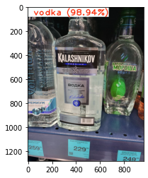

# Retail ML pipeline

A project on machine learning courses. Pipeline is used internally: YOLO for item detection, price tags and price, EfficientNet for item classification. FastAPI and Streamlit as backend and frontend respectively.

Demo: http://62.148.235.120:8501/

Build: `docker-compose up -d --build`

Run: `docker-compose up -d`

Already implemented and plans:
- [x] YOLO for item detection, price tags and price
- [x] EfficientNet for item classification
- [x] Backend + frontend
- [ ] OCR
